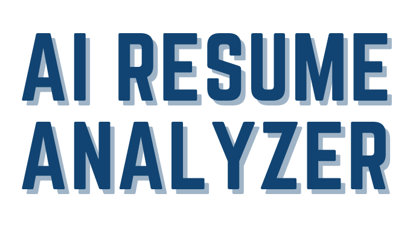

<p><small>Best View in <a href="https://github.com/settings/appearance">Light Mode</a> and Desktop Site (Recommended)</small></p><br/>


<div align="center">
  <h1> AI RESUME ANALYZER </h1>
  <p>A Tool for Resume Analysis, Predictions and Recommendations</p>
  <!-- Badges -->
  <p>
    
    
    
    
    <a href="https://github.com/Yahya305/AI-Resume-Analyzer/blob/main/LICENSE">
      
    </a>
  </p>
  
  <p>
    <small align="justify">
      Made with ❤️ by 
      <a href="https://github.com/Yahya305/">Yahya Salman</a>, a MERN Stack Developer and aspiring DevOps Engineer.
     </small>
  </p>
</div><br/><br/>

## About the Project 🥱
<div align="center">
    <br/><br/><br/>
    <p align="justify"> 
      A tool which parses information from a resume using natural language processing and finds the keywords, clusters them onto sectors based on their keywords, and shows recommendations, predictions, and analytics to the applicant/recruiter based on keyword matching.
    </p>
</div>

## Scope 😲
i. Converts resume data into a structured tabular format and CSV for analytics purposes.  
ii. Provides recommendations, predictions, and overall scores to help users improve their resumes.  
iii. Increases traffic by engaging users with features like resume scoring and suggestions.  
iv. Useful for colleges to assess students' resumes before placements.  
v. Provides analytics for trending roles and user behavior.  
vi. Collects feedback to continuously improve the tool.

<!-- TechStack -->
## Tech Stack 🍻
<details>
  <summary>Frontend</summary>
  <ul>
    <li><a href="https://streamlit.io/">Streamlit</a></li>
    <li><a href="https://developer.mozilla.org/en-US/docs/Learn/HTML">HTML</a></li>
    <li><a href="https://developer.mozilla.org/en-US/docs/Web/CSS">CSS</a></li>
    <li><a href="https://developer.mozilla.org/en-US/docs/Learn/JavaScript">JavaScript</a></li>
  </ul>
</details>

<details>
  <summary>Backend</summary>
  <ul>
    <li><a href="https://streamlit.io/">Streamlit</a></li>
    <li><a href="https://www.python.org/">Python</a></li>
  </ul>
</details>

<details>
<summary>Database</summary>
  <ul>
    <li><a href="https://www.mysql.com/">MySQL</a></li>
  </ul>
</details>

<details>
<summary>Modules</summary>
  <ul>
    <li><a href="https://pandas.pydata.org/">pandas</a></li>
    <li><a href="https://github.com/OmkarPathak/pyresparser">pyresparser</a></li>
    <li><a href="https://pypi.org/project/pdfminer3/">pdfminer3</a></li>
    <li><a href="https://plotly.com/">Plotly</a></li>
    <li><a href="https://www.nltk.org/">NLTK</a></li>
  </ul>
</details>

<!-- Features -->
## Features 🤦‍♂️
### Client: -
- Parse Basic Info, Skills, and Keywords from resumes.
- Provide recommendations for skills, predicted job roles, certifications, and overall scores.
- Offer tips, videos, and suggestions to improve resumes.

### Admin: -
- View all applicants’ data in tabular format.
- Export users’ data to CSV.
- Access and analyze feedback, ratings, and user demographics.

### Feedback: -
- Collect user ratings (1-5).
- Visualize ratings and user comments with pie charts.

## Requirements 😅
### Install the following for a smooth setup: 
1) Python (3.9.12)  
2) MySQL  
3) Visual Studio Code  
4) Visual Studio build tools for C++  

## Setup & Installation 👀
Clone the repository:
```bash
git clone https://github.com/Yahya305/AI-Resume-Analyzer.git
